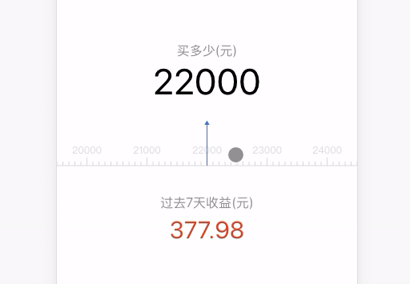

# canvas-slide-calculator

仿蚂蚁财富app的滑动收益计算器

## [Demo](https://lchreal6.github.io/canvas-slide-calculator/build/)



## 使用

install 

```bash
npm i canvas-slide-calculator --save
```

import 

```js
import Calculator from "canvas-slide-calculator";
```

### Simple Demo

```jsx
import React, { Component } from 'react';
import Calculator from 'canvas-slide-calculator';

class App extends Component {

  state = {
    activeIndex: 0
  }

  componentDidMount() {
    const self = this;
    const arrData = [0, 10, 20, 30, 40, 50];
    const options = {
      width: window.innerWidth,
      height: 100,
      element: '#calculator',
      data: arrData,
      onSelect(data) {
        self.setState({
          activeIndex: data
        })
      }
    }

    const cal = new Calculator(options);
    cal.render(); 
  }

  render() {
    return (
      <div className="App">
        <div >{this.state.activeIndex}</div>
        <canvas id="calculator"></canvas> 
      </div>
    );
  }
}

export default App;
```

## API
<table>
  <tbody>
    <tr>
      <th>属性</th>
      <th>类型</th>
      <th>默认值</th>
      <th>说明</th>
    </tr>
    <tr>
      <td>width</td>
      <td>number</td>
      <td>null</td>
      <td>
        canvas的宽度
      </td>
    </tr>
    <tr>
      <td>height</td>
      <td>number</td>
      <td>null</td>
      <td>
        canvas的高度
      </td>
    </tr>
    <tr>
      <td>data</td>
      <td>array</td>
      <td>[]</td>
      <td>
        所传入需要展示数据的数组
      </td>
    </tr>
    <tr>
      <td>element</td>
      <td>string</td>
      <td><code>"#id"</code></td>
      <td>
        需要绑定的dom元素
      </td>
    </tr>
    <tr>
      <td>onSelect</td>
      <td><code>(data) => {}</code></td>
      <td>null</td>
      <td>
        计算器当前所选中的数据回调函数
      </td>
    </tr>
  </tbody>
</table>


